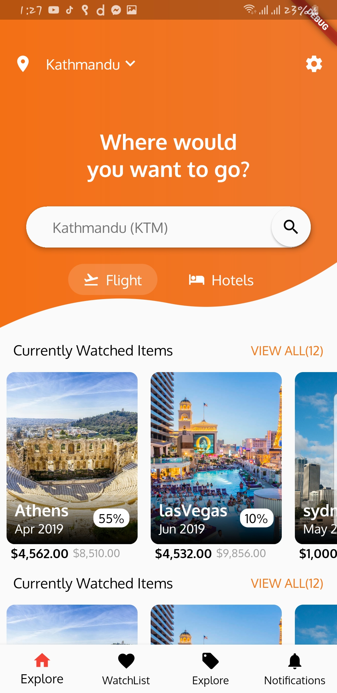
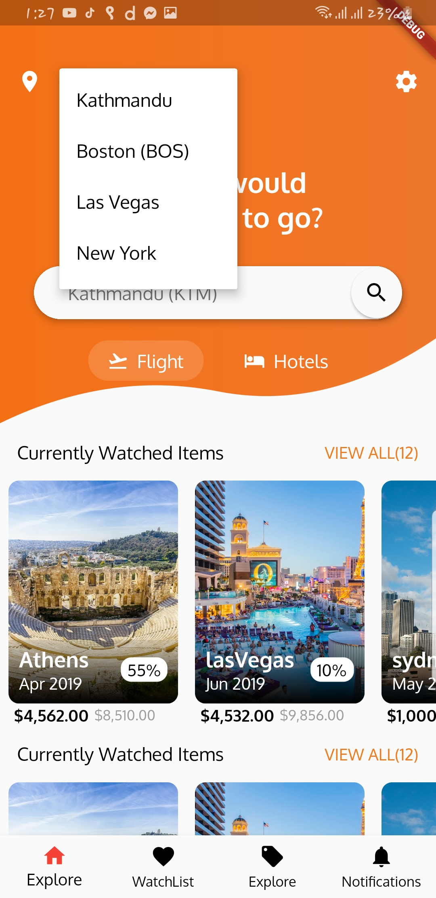
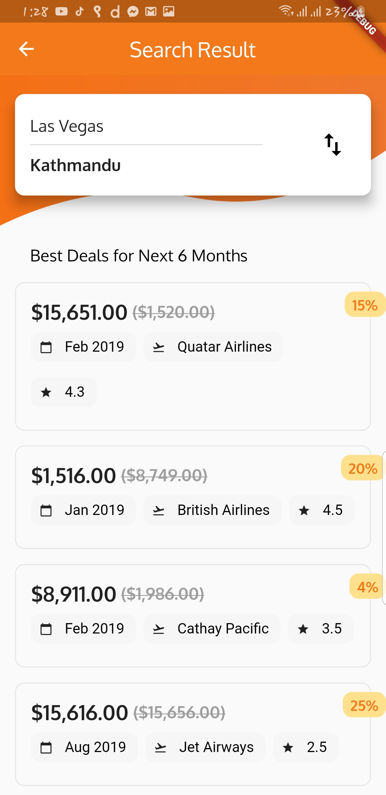

# Flutter UI Challenges
My effort on replicating various apps UI on flutter.

## Credits
This Ui sample is taken UpLabs

## For More UI Challanges 
Visit (https://www.mausamrayamajhi.com.np/)

### Whats implemented
 - Working bottom navigator to show different pages
 - Navigation push/pop to show details page
 - Stateless & Stateful Widgets
 - Custom widgets for list
 - firebase implementation
 - Data are fetched from firebase

## Ecommerce
   &nbsp; &nbsp;   &nbsp; &nbsp;       